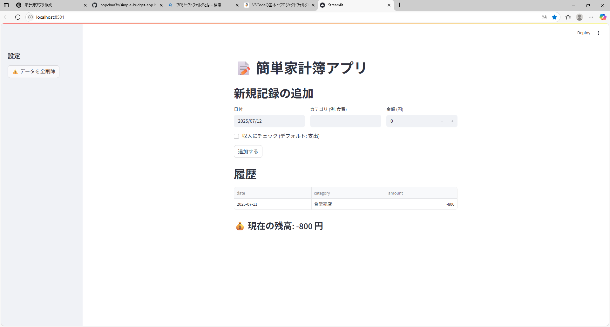

# 📝 Simple Budget App

超シンプルな Streamlit 製家計簿アプリです。  
ローカル JSON に保存するだけなので、初心者の “最初の一本” にちょうどいい構成になっています。

## 使い方

```bash
# 依存インストール
pip install -r requirements.txt

# アプリ起動
streamlit run budget_app.py
```



